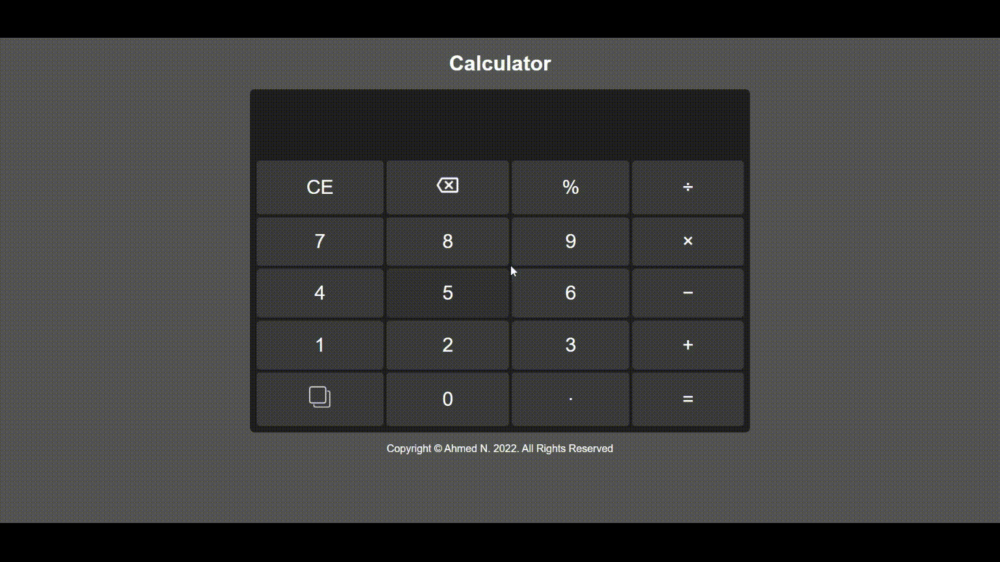
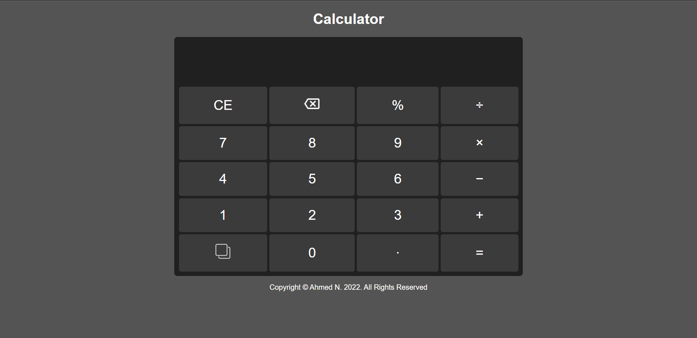
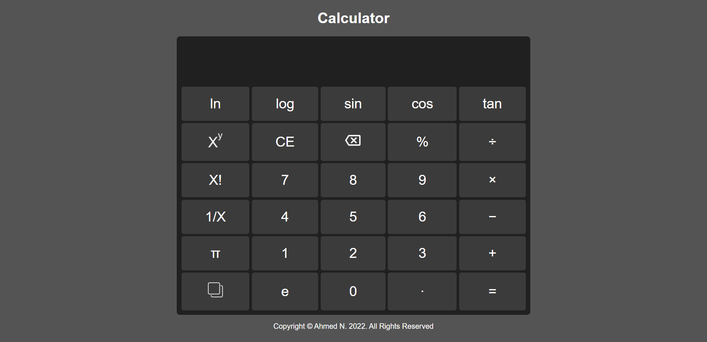
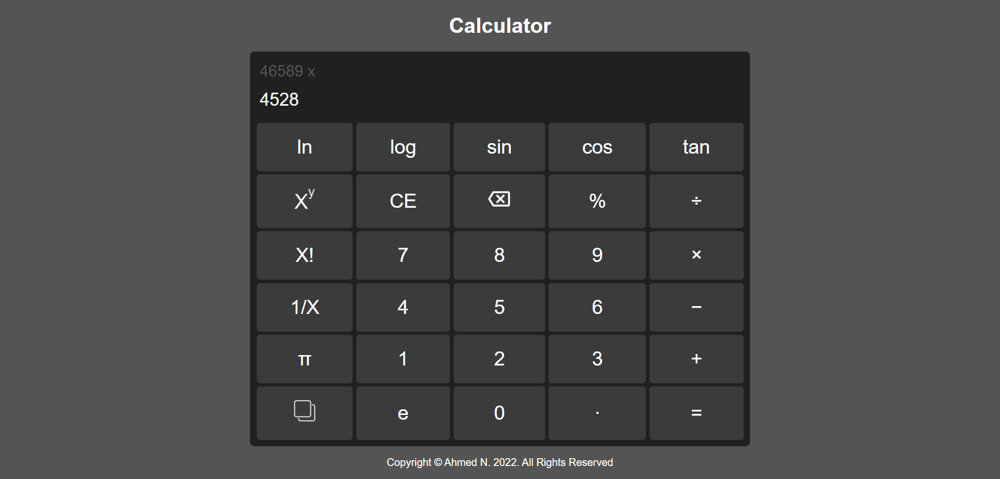
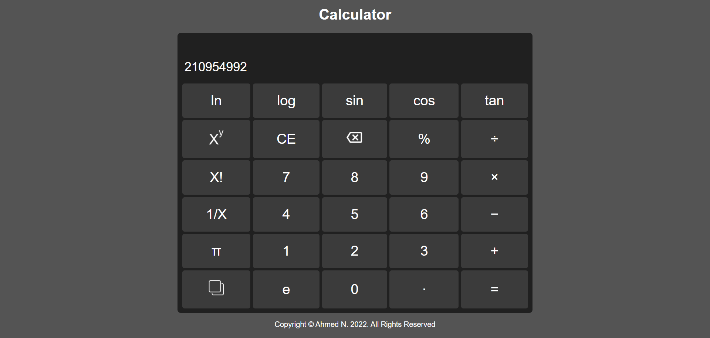

<h1 align="center">Calculator</h1>
It's a Calculator Website <b>Developed using JavaScript</b>  

## How to run

Use this [link](https://ahmed-nd.github.io/Calculator/) to run the web site

## Gallery

|  Screenshots    |
|:----:|
|  |
|  |
|  |
|  |

## Author

#### Ahmed Nasser

You can also follow my GitHub Profile to stay updated about my latest projects:

If you liked the repo then kindly support it by giving it a star ⭐!
